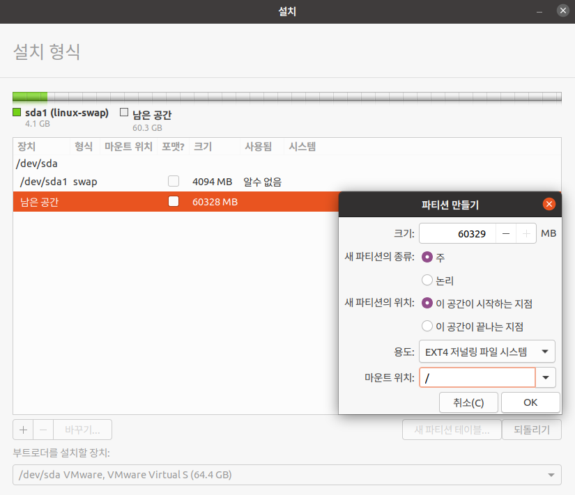

# 1 우분투 리눅스 설치

일반적인 컴퓨터 환경은 다음과 같다.


여기서 실습을 위해 가상머신 프로그램을 이용해서, 추가로 4대의 가상머신(게스트 컴퓨터)를 만들고 리눅스 3대와 Window 1대를 설치할 것이다.


- 3대의 리눅스(server A,B와 client 하나)와 1대의 Window client

4대의 가상머신은 가상 IP address를 할당 받고, 가상 router를 통해 하나의 network로 묶어서 사용한다.


실습할 가상머신의 사양은 다음과 같이 설정한다.


---

## 1.1 실습 환경 구축

VMware Workstation Pro를 이용해서 진행한다. 실습해서는 하위 버전인 15.5를 권장한다.(상위 버전에서 오류 발생)

> Pro를 쓰는 이유는 스냅숏과 네트워크 설정 기능을 사용할 수 있기 때문이다. 평가판으로 30일 무료로 사용할 수도 있다. 

C:\Ubuntu20.04\Server 폴더에 아래와 같이 폴더 네 개(Client, Server, Server(B), WinClient)를 만들었다.


우선 Server 폴더 내에 가상머신을 설치한다. Workstation 상단의 [Flie] - [New Virtual Machine] 메뉴를 통해 만들 수 있다.


> 참고로 참고로 이 설정대로 한다면 가상머신에 20GB로 인식되지만, 실제 물리 파일의 크기는 겨우 10MB로 설정된다.(따라서 크게 할당해도 별 문제는 없을 가능성이 크다.) OS가 설치되면서 실제 공간이 필요해지면 자동으로 조금씩 늘어난다.(지금대로라면 20GB보다 늘어나지는 않는다.)

> [Edit virtual machine]으로 들어가서 Hard Disk (SCSI)를 Remove 후, Add 버튼을 눌러 SCSI 하드디스크를 다시 추가할 수 있다.

> 추가로 할당할 memory(RAM) 용량이나, 멀티코어라면 CPU를 여러 개 할당하는 등 설정이 가능하다.

아래는 생성이 완료된 Server 폴더 내부이다. \*.vmdk 파일이 바로 가상 하드디스크 파일이다.

> 가상머신을 VMware Workstation 라이브러리에 추가할 때는 \*.vmx 파일을 열면 된다.


나머지 Server(B), Client, WinClient도 동일한 방법으로 생성한다.

---

## 1.2 서버 구동 방법

Server를 구동하는 법을 보자. Power on this virtual Machine을 누르면 구동을 할 수 있으나, 아직 OS를 설치하지 않았기 때문에 오류 메시지가 뜬다.

참고로 가상머신을 부팅 후 내부에 마우스 클릭 후 F2를 여러 번 눌러 BIOS 설정 화면으로 진입할 수 있다.


> 단축키 ctrl+alt를 눌러 컴퓨터의 제어로, ctrl+g를 눌러 가상머신의 제어로 전환할 수 있다.

> 가상머신 내 ctrl+alt+del을 누르고 싶다면, ctrl+alt+insert를 누르면 된다.(VMware 메뉴를 사용해도 된다.)

> 전체화면은 VMware의 최대화 아이콘이나 ctrl+alt+enter를 입력하면 된다.

현재는 OS 설치 이전이므로 workstation 메뉴 상단에서 Shut Down Guest를 눌러 가상머신을 종료한다.

> 참고로 종료 시 일시 정지(Suspend) 또는 종료(Power Off) 중 선택할 수 있다. 기본 설정은 Suspend로 되어 있다. Suspend는 노트북 화면만 닫은 상태와 비슷하게 보면 된다.

VMware Player는 한 번에 가상머신 하나만 부팅할 수 있다. 따라서 여러 개의 가상머신을 동시에 부팅하고 싶다면, VMWare Player를 여러 개 실행해야 한다.

---

## 1.3 VMWare 네트워크 설정

정상적인 네트워킹을 위해 각 가상머신(Guest OS)에 관련 정보를 입력해야 한다. IP address, Subnet Mask, Gateway address, DNS server address를 입력해야 한다.

- Subnet Mask란 로컬 네트워크 내부에서 '접속한 Host(각각의 노드, 즉 PC, 스마트폰, 태블릿 등)의 IP 대역을 외부 네트워크와 명확히 구분하여 주는 수단이다.

   - 기본적으로 Subnet 내 Host들은 같은 Subnet의 Host끼리만 통신이 가능하다. 만약 Subnet에 속하지 않은 대상을 찾아가고가 한다면, Gateway를 통해 해당 네트워크를 나가서 여러 router를 거쳐 그 대상이 속한 네트워크를 찾아내야 한다.

   - subnet mask는 binary로 11111111.11111111.11111111.00000000이다. 이를 decimal 표기법으로 변환한 octet으로 나타내면 255.255.255.0이 된다. 이를 이용해서 network ID와 host ID를 구분할 수 있다.

   > 예를 들어 192.168.123.132 IP를 두 부분으로 나누면, 192.168.123.0은 network address, 0.0.0.132는 host address에 해당된다. 

- Gateway IP address는 해당 네트워크 내 컴퓨터에 할당된 IP address 중 끝자리(4번째 octet)만 다른 형태다.(대개 1로 지정한다.) 

   - 예를 들어 컴퓨터 IP address가 123.123.132.123이면, gateway IP address는 123.123.132.1이 된다.

> cmd상에서 Ipconfig /all 명령을 치면 'VMware Virtual Ethernet Adapter for VMnet8' 항목이 뜬다. 여기서 항목별로 확인할 수 있다.

```bash
이더넷 어뎁터 VMware Network Adapter VMNet8:
# ...
IP 주소: 192.168.XXX.3 ~ 192.168.XXX.254
서브넷 마스크: 255.255.255.0
게이트웨이: 192.168.XXX.2
DNS 서버: 192.168.XXX.2
```

그러나 실습에서는 책 저자와 address를 맞추기 위해 111로 변경할 것이다. 우선 VMware Workstation Pro 상단 메뉴의 [Edit] - [Virtual Network Editor]를 선택한다.


우측 하단의 Change Settings를 누른 뒤, 하단 사진처럼 VMnet8의 Subnet IP의 세 번째 address 값만 111로 변경하고 OK를 눌러 반영한다.


> 이렇게 설정이 됐다면 cmd상에서 ipconfig /all 명령을 했을 때 192.168.111.1(기본 설정)이 된 모습을 확인할 수 있다.

다음은 실습의 전체 네트워크 정보를 표현한 그림이다.


- Host OS: 192.168.111.1이라는 virtual address가 자동으로 할당되어 있다.

   - 참고로 실제로 사용하는 IP address는 별도로 존재한다.

- Gateway 겸 DNS Server: 말 그대로 Gateway, DNS Server 두 가지 역할을 모두 하는 가상 장치의 IP address다.

- DHCP Server: IP를 유동적으로 관리하는 protocol이다. 현재 가상의 address 192.168.111.254를 가지고 있다.

- 실습에서는 Server, Server(B) 가상머신에 고정 IP를 할당한다. 이는 DHCP Server에서 할당을 받게 된다.

| 설정 | Server | Server(B) | Client | WinClient |
| --- | :---: | :---: | :---: | :---: |
| IP address | 192.168.111.100(고정) | 192.168.111.200(고정) | 자동 할당(DHCP) | 자동 할당(DHCP) |
| 서브넷 마스크 | 255.255.255.0(직접 입력) | 자동 할당(DHCP) | 자동 할당(DHCP) |
| 게이트웨이 | 192.168.111.2(직접 입력) | 자동 할당(DHCP) | 자동 할당(DHCP) |
| DNS server | 192.168.111.2(직접 입력) | 자동 할당(DHCP) | 자동 할당(DHCP) |

> 참고로 Host OS - Guest OS 사이에 파일을 전송하려면, 해당 파일을 ISO 파일로 만들어 주면 된다. 이를 Guest OS에 CD/DVD를 넣어주면 간단하게 파일을 전송할 수 있다.

---

## 1.4 Server 우분투 리눅스 설치

우선 Server에 우분투 리눅스를 설치할 것이다. 

> [소스 구글 드라이브](https://drive.google.com/drive/folders/1c6Q2m0SAxu77fx2fwEmTduJ3Wxi2x_PM)

- Server용: ubuntu-20.04-desktop-amd64 파일

- Server(B)용: ubuntu-20.04-live-server-amd64 파일

- Client용: kubuntu-20.04-desktop-amd64 파일

Edit Virtual machine settings 메뉴를 누른 뒤, CD/DVD (SATA)에서 ISO 파일을 선택하여 넣어준다.


그 다음 가상머신을 부팅한다.


Ubuntu 체험하기를 누르면 잠시 후 다시 부팅된다.(해상도 변경을 한 뒤 다시 설치를 하기 위함이다.) 부팅이 됐다면 우측 상단 메뉴에서 setting을 눌러서 해상도를 바꿔야 한다.


[Displays] 메뉴에서 Resolution을 '1024x768(4:3)'으로 선택한다. 이후 우측 상단의 Apply를 누르고 \<Keep Changes\>를 클릭하면 화면 해상도가 변경된다.

이후 Setting을 나와서 'Ubuntu 20.04 LTS 설치'를 실행한다. 이때 키보드 레이아웃에서 맨 위의 Korean을 선택한다.


- 업데이트 및 기타 소프트웨어에서 'Ubuntu 설치 중 업데이트 다운로드'의 체크를 해제한다.

- 설치 형식에서 '기타'를 선택한다.

- 설치 형식에서 '새 파티션 테이블'을 선택한 뒤 경고문에서 '계속하기'를 누른다. 

- 남은 공간을 선택하고 왼쪽 하단의 <+>를 클릭한다. [파티션 만들기] 창이 나오면 [크기]에 4096을 입력하고, [용도]를 '스왑 영역'으로 선택한 뒤 OK을 클릭한다.


- 마찬가지로 이전에 선택한 남은 공간에서 다시 왼쪽 하단의 <+>를 클릭한다. [크기]는 그대로 둔 채 [새 파티션의 종류]를 '주'로 클릭한 뒤, [용도]는 'EXT4 저널링 파일 시스템'으로 설정한다. [마운트 위치]는 '/'로 선택한다. 이후 <OK>를 클릭한다.




끝났다면 오른쪽 아래 <지금 설치>를 클릭하고, 경고창에서 <계속하기>를 클릭한다.

당신은 누구십니까? 화면에서는 다음과 같이 입력한다. 지금은 실습을 위해 암호도 ubuntu로 설정했으나, 사실 이런 설정은 보안상 좋지 않으므로 실무에서는 피해야 한다.


설치가 완료되면 <지금 다시 시작>을 클릭해서 Server를 재부팅하면 마무리가 된다.

> 참고로 재부팅이 완료된 뒤 DVD 장치를 제거하라는 메시지에 따라 Enter를 누르면 자동으로 DVD가 제거된다.(뜨지 않는다면 수동으로 제거하면 된다.)

> 로그인 뒤 초기 설정은 대부분 건너뛰기를 하면 된다. 다만 해상도는 다시 1024x768 (4:3)으로 설정해야 한다.

그 다음 해야 하는 설정은 다음과 같다.

1. 관리자인 root 사용자를 활성화한다.

   - 바탕 화면에서 우클릭을 한 뒤 [Open in Terminal]을 선택해 터미널을 연다.

   - 다음 명령을 차례로 입력한다.

   ```bash
   sudo su - root
   ubuntu    // 사용자의 password 입력
   passwd
   password  // root 사용자의 비밀번호 입력. 여기서는 password로 지정했다.
   password
   ```

2. 바탕 화면 상단의 ▽ 아이콘을 눌러 설정에 들어간 뒤, [사용자] 메뉴에서 오른쪽 위 <잠금 해제>를 클릭한다. 암호를 입력해 준 뒤 [자동 로그인]을 킨다.

3. 터미널에서 nano /etc/gdm3/custom.conf 명령을 실행해서 파일을 open한다. 다음 행들을 수정한다.(nano는 텍스트 편집기)

   ```bash
   //19행
   AutomaticLogin=ubuntu    # ubuntu -> root로 변경
   
   [security]
   AllowRoot=True    # 추가한다. 
   ```

   - 수정을 완료했다면 ctrl+x를 누른 뒤 Y(Yes)와 Enter를 눌러 변경 내용을 저장한다.

4. nano /etc/pam.d/gdm-password 명령으로 파일을 open한 뒤, 3행 앞에 #를 붙여서 주석으로 바꾼다. 마찬가지로 변경 내용을 저장한다.

   ```bash
   #auth required ...
   ```

5. nano /etc/pam.d/gdm-autologin 명령으로 open하고 마찬가지로 3행 앞에 #를 붙여 주석 처리하고 저장한다.

   ```bash
   #auth requried ...
   ```

   

6. reboot 명령으로 Server를 재부팅한다.(이제 별도의 입력 없이 root로 자동 로그인된다.)

7. 좌측 하단 [프로그램 표시]를 누른 뒤 '소프트웨어&업데이트'를 실행한다. [업데이트] 탭에서 [자동으로 업데이트 확인]을 '하지 않기', [새 우분투 버전 알려주기]도 '하지 않기'로 변경한다.

8. 터미널을 열고 다음 명령을 차례로 입력한다. (설정 파일의 이름을 변경) 

   ```bash
   cd /etc/apt
   mv sources.list sources.list.bak
   ls
   ```

   

9. 터미널에서 다음과 같이 명령을 입력하여 sources.list 파일을 다운로드한다.

   ```bash
   wget http://dw.hanbit.co.kr/ubuntu/20.04/sources.list
   ls
   ```

   


10. apt update 명령으로 설정한 내용을 적용한다.

   ```bash
   apt update
   ```

11. exit 명령으로 터미널을 닫는다.

> 추가로 설정에서 화면 보호기([전원])를 끄고, [지역 및 언어]에서 첫 번째 한국어 키보드를 제거한다. 한국어(Hangul)만 남긴다.

> 한/영 전환은 shift + space 버튼이다.

---

### 1.4.1 네트워크 설정

바탕 화면에서 ▽ 버튼을 눌러서 메뉴를 본다. [유선 연결됨]을 클릭하면 [유선 네트워크 설정] 메뉴를 선택할 수 있다.


네트워크에서 [유선]에 연결됨 - 1000Mb/s 옆에 있는 톱니바퀴를 누른다. 이후 [IPv4] 탭을 누른 뒤, IPv4 방식을 '수동'으로 변경한다. [주소]와 [네임서버(DNS)] 항목은 다음과 같이 입력한다.(네임서버의 자동도 해제한다.)


완료가 됐으면 상단의 적용을 눌러 변경 내용을 저장한다. 그 다음 설정에서 나와 터미널을 다시 열어 reboot 명령으로 컴퓨터를 재부팅한다.

재부팅이 되면 터미널에서 ip addr 명령을 입력하여 네트워크 설정이 제대로 반영되었는지 확인한다.(ens33 부분만 확인하면 된다.)


- inet 192.168.111.100으로 설정된 것을 확인할 수 있다.

---

### 1.4.2 필수 패키지 설치, 방화벽 실행

터미널에서 다음 명령들을 입력하자.

```bash
apt -y install net-tools    # 패키지 설치

ufw enable     # 방화벽 실행
```

이후 터미널에서 halt -p 명령을 입력해서 시스템을 종료한다. 이것으로 Server의 설치와 설정은 완전히 마무리가 되었다.

Server가 종료되면 [Edit virtual machine settings] 메뉴로 가서, CD/DVD로 넣은 ISO 이미지 파일을 제거한다. Use physical drive를 체크하면 된다. (Connect at power on 체크도 해제한다.)

그리고 이렇게 설정이 완료된 Server를 Snapshot으로 저장한다.(라이브러리에서 Server을 우클릭하면 스냅숏이 가능하다. 스냅숏 이름은 '설정 완료'로 정했다.)

> 상단 메뉴 [VM] - [Snapshot] - [Snapshot Manager]에서, 원하는 snapshot를 누른 후 <Go To> 버튼을 누르면 해당 시점으로 롤백할 수 있다.

> 이때 혹시나 경고가 뜨면 I Moved it을 클릭해야 한다. 안 그럼 가상머신을 초기화해야 하는 사태가 발생한다.

---

## 1.5 Server(B) 설치하기

Server(B)는 Server나 Clinet와 달리 X 윈도를 사용하지 않고 텍스트 모드에서만 사용할 것이다.

미리 다운로드한 'ubuntu-20.04-live-server-amd64.iso' 이미지 파일을 넣은 뒤 Server(B)를 부팅한다.

> Failed 같은 오류 메시지는 무시하면 된다.

- 언어 선택은 기본값인 English로 진행한다.(텍스트 모드이므로 명령으로 인식이 안 되는 한글은 필요가 없다.)

- [Profile setup] 메뉴 전까지 계속 Done을 선택하며 진행한다.

    - [Guided Storage configuration]에서는 탭키를 4번 누르면 Done으로 이동할 수 있다. 

    - Storage configuration에서 Done을 선택하면 뜨는 경고에서는, 탭키를 한 번 눌러 Continue를 선택한다.

- Profile setup 메뉴에서는 다음과 같이 입력한다.(다음 입력으로 탭키를 입력해서 넘어갈 수 있다.) password는 'ubuntu'로 지정했다. 입력이 끝나면 Done을 선택하여 넘어간다.


- SSH Setup, Featured Server Snaps 메뉴도 탭키를 한 번 눌러 Done을 선택한다. 

- 설치가 진행(완료 후 설치하는 security updates도 그대로 진행한다. 시간이 꽤 소요된다.)되고, 모든 설치가 완료되면 나타나는 Reboot를 선택하여 재부팅한다.

- 컴퓨터가 재부팅된 뒤 'Please remove the installation medium, then press ENTER' 메시지가 나온다. Enter 버튼을 누르면 알아서 설치 DVD를 VMware가 제거한다.

---

### 1.5.1 초기 설정

재부팅이 된 뒤 텍스트 모드를 사용할 수 있다. 처음 [server-b login]이 나와도 잠시 기다린다. 어느 정도 초기화 작업이 끝난 뒤 나오는 [OK] 메시지를 기다린다.

> [OK] Reached target Cloud-init target' 메시지 이후 한동한 멈춰 있다면, Enter를 눌러 프롬프트가 나오게 한다.

[server-b login]에는 설치 시 지정한 'ubuntu'를 입력하고, 그 다음에 요구하는 password도 입력해 준다. 올바르게 입력했다면 다음과 같이 프롬프트가 나타난다.


> 이 다음부터는 리눅스 명령어를 사용해서 관리하면 된다.

1. 먼저 Ubuntu 20.04 LTS의 초기 소프트웨어만을 설치한다. 다음 명령을 차례로 입력한다.

    ```bash
    clear    # 화면 청소
    cd /etc/apt
    ls
    ```

2. sources.list 파일의 이름을 변경한다. ls로 변경이 제대로 되었는지 확인한다.

    ```bash
    sudo mv sources.list sources.list.bak
    # 이때 password('ubuntu'로 설정)를 입력해야 한다.
    ls
    ```

3. 다음 명령으로 새로운 sources.list를 다운로드한다.

    ```bash
    sudo wget http://dw.hanbit.co.kr/ubuntu/20.04/sources.list
    # 마찬가지로 password 입력
    ls
    ```

4. sudo apt update 명령으로 패키지를 설치한다.

   ```bash
   sudo apt update
   ```

---

### 1.5.2 Server(B) 네트워크 설정, 관리자 활성화

Server(B)의 IP address를 192.168.111.200으로 변경할 것이다.

1. 우선 ip addr 명령으로 현재 네트워크 장치의 이름(ens32)을 확인해 둔다.

   ```bash
   ip addr
   ```

   

2. 관련 디렉터리로 이동한 뒤 nano 에디터로 파일을 편집한다.

   ```bash
   clear
   cd /etc/netplan/
   ls    # *.yaml 파일을 확인한다.
   sudo nano 00-Installer-config.yaml
   ```

3. 5행을 편집한다. 현재 'dhcp4: true'로 설정되어 있는데, 이는 자동으로 IP address를 할당받는다는 의미다. dhcp4를 수정하고 다음과 같은 문장을 추가한다.(완료되면 ctrl + x, y, enter 순으로 눌러서 저장한다.)

   ```bash
   #4행
   ens32:
       dhcp4: no
       addresses: [192.168.111.200/24]
       gateway4: 192.168.111.2
       nameservers:
           addresses: [192.168.111.2]
   ```

   

4. 관리자인 root를 활성화시키고, 비밀번호를 'password'로 지정한다. 

   ```bash
   sudo su - root
   passwd    # 지정할 비밀번호(password)를 두 번 입력한다
   ```

5. reboot 명령으로 재부팅한다.(이제 root 사용자로 접속된다.)

6. [server-b login]에 'root'를, [Password]에 앞서 정한 비밀번호인 'password'를 입력하여 접속한다.

7. ip addr 명령으로 ip address가 제대로 192.168.111.200으로 설정되었는지 확인한다. 또한 ping -c 3 www.google.com 명령으로 네트워크 동작이 제대로 되는지 여부도 확인한다.

    

8. ufw enable 명령으로 방화벽을 켠다.

9. apt -y install net-tools 명령으로 필수 패키지를 설치한다.

10. halt -p 명령을 입력해 컴퓨터를 종료한다.

모두 완료되었다면 VMware에서 Server(B)의 할당 메모리를 1GB로 낮춘다. 그리고 CD/DVD 이미지를 제거해 준다. 마지막으로 현재 단계를 snapshot(설정 완료)으로 저장한다.

---

## 1.6 Client 설치하기

Kubuntu 20.04 LTS를 설치한다. Client에 'kubuntu-20.04-desktop-amd64.iso' 이미지를 넣고, Server 가상머신과 거의 동일하게 진행하며 설치한다.

> 버튼이 안 보이면 드래그로 윈도우를 옮기면 된다.

- Server와 다르게 체험하기가 아니라 바로 설치를 진행한다.(한국어로 설치)

- [업데이트 및 기타 소프트웨어]에서 'Kubuntu 설치 중 업데이트 다운로드' 체크를 해제한다.

- [설치 형식]에서 '자동 - 디스크 전체 사용'이 선택된 상태로 <지금 설치>를 클릭한다. [바뀐 점을 디스크에 쓰시겠습니까?]란 창이 뜨면 <계속하기>를 클릭한다.

- [당신은 누구십니까?]에서는 다음과 같이 입력한다.(password는 'ubuntu'로 설정한다.) 또한 [자동으로 로그인]에 체크한다.

   

- 설치가 완료되면 <지금 다시 시작>을 눌러 재부팅하고, DVD 장치를 제거하라는 메시지에 Enter를 누른다.

---

### 1.6.1 초기 설정

설치가 완료되었다면 해상도를 1024x768로 조절한다. 왼쪽 하단을 눌러 설정으로 들어갈 수 있다.([디스플레이와 모니터])

해상도 조절이 끝났다면 마찬가지로 왼쪽 하단을 누른 뒤 [프로그램]을 클릭하고, [Konsole 터미널]을 실행한다. 그리고 다음 명령으로 sources.list 파일을 변경한다.

```bash
cd /etc/apt
sudo mv sources.list sources.list.bak
sudo wget http://dw.hanbit.co.kr/ubuntu/20.04/sources.list
ls
```

변경이 완료됐으면 sudo apt update 명령으로 패키지를 설치한다.

또한 완료가 되었으면 추가로 sudo apt -y install net-tools 명령으로 필수 패키지를 설치한다. 설치가 끝나면 exit 명령으로 터미널을 닫는다.

이 다음으로 [프로그램 실행기] - [시스템 설정] - [전원 관리]에서 '화면 에너지 절약'의 체크를 해제한다.

> 참고로 한글은 ctrl + space 키로 전환할 수 있다.

마무리로 halt -p 명령을 입력해서 시스템을 종료한다. DVD를 제거하고, 메모리를 조절한다. 그리고 snapshot을 찍어 현재 상태를 보존한다.

---

## 1.7 WinClient 설치

Windows 10 한국어 32비트(x86)용을 설치한다. 마찬가지로 ISO를 넣어서 설치한다.

> [다운로드 링크](https://www.microsoft.com/ko-kr/evalcenter/evaluate-windows-10-enterprise)

WinClient는 설치 완료 후에 VMware Tools를 설치하는 편이 좋다. 가상머신 메뉴에서

> 만약 자동으로 설치되지 않는다면, 가상머신의 파일 탐색기에서 'D:\' 폴더에 있는 setup.exe를 실행하면 된다.

마무리로 WinClient도 snapshot(설정 완료)를 설정한다.

---