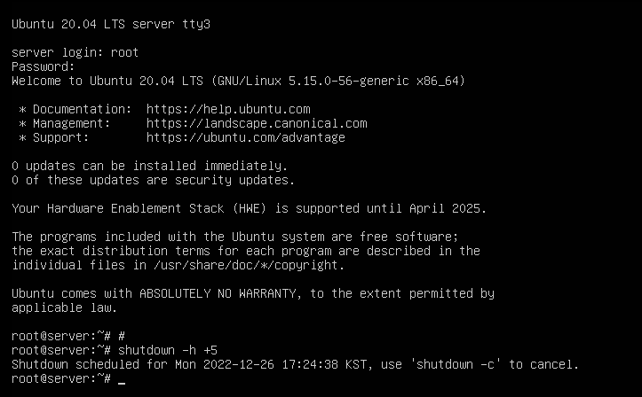

# 4 서버 구축 시 알아야 할 필수 개념과 명령어

들어가기 앞서 유닉스/리눅스에서는 <U>대문자와 소문자를 명확히 구분한다</U>는 점을 기억하자. 또 주의할 점으로는 일반 사용자가 관리자(root 사용자) 권한을 얻으려면 'sudo 명령어'를 실행하고 암호를 입력해야 한다.


> 참고로 <U>관리자인 root와 일반 사용자는 프롬프트의 표식으로 구분</U>된다. '**#**'이면 관리자인 root, '**$**'면 일반 사용자이다.

Server와 Client를 부팅하면 GUI인 X Window(X 윈도)가 자동으로 실행된다. 비슷하게 GUI인 Windows가 그래픽 모드가 없으면 운영이 거의 불가능한 것과 달리, 리눅스의 X 윈도는 하나의 유틸리티일 뿐 반드시 필요하지는 않다.

> Server(B)가 X 윈도를 설치하지 않았다. 그럼에도 운영에는 문제가 없다.

---

## 4.1 기초 명령어

man {명령어}를 입력해서 해당 명령어를 설명하는 도움말을 볼 수 있다.(manual의 약어다.)

---

### 4.1.1. X 윈도 종료

우선 X 윈도를 종료하는 방법을 소개한다.

- 메뉴 이용: 우측 상단 ▽ 메뉴를 눌러서 [컴퓨터 끄기/로그아웃] - [컴퓨터 끄기]를 선택하여 종료하는 간단한 방법이다.

- 시스템 종료 명령 이용: 터미널에서 다음 네 가지 명령 중 하나를 입력하면 된다.

   ```bash
   poweroff
   shutdown -P now    # P: Poweroff
                      # now 대신 다른 시간을 지정할 수도 있다.
   #shutdown -P +10   # 10분 후 종료
   #shutdown -c       # shutdown 취소(cancel)
   #shutdown -r 22:00 # 22:00에 재부팅
   halt -p
   init 0
   ```

> 우분투 재부팅은 reboot, shutdown -r now, init 6 등의 명령을 사용하면 된다.

---

### 4.1.2 로그아웃

리눅스는 여러 사용자가 동시에 접속해서 사용하는 multi-user 시스템이므로, 종료가 아닌 사용자 자신만 접속을 끝내는 로그아웃이 필요하다.

- 메뉴 이용: 우측 상단 ▽ 메뉴를 눌러서 [컴퓨터 끄기/로그아웃] - [로그아웃]를 선택한다.

- 시스템 로그아웃 명령 이용: logout 또는 exit 명령을 입력한다.

---

### 4.1.3 가상 콘솔

우분투는 총 6개(2~7번)의 가상 콘솔을 제공한다. 즉, 서버 1대로 모니터 7개를 조작할 수 있는 셈이다.

우선 Server를 부팅하면 자동으로 실행되는 X 윈도에서 보이는 화면은, 6개의 가상 콘솔 중 2번째에 해당한다. 나머지 3~6번 가상 콘솔은 텍스트 모드로 제공된다.

각 가상 콘솔로 이동하는 단축키는 '**ctrl + alt + F2 ~ F7**'이다. 아래는 F3으로 3번째 콘솔을 들어간 화면이다.


- tty3: 3번째 콘솔을 의미한다.

- root 사용자로 접속하면 된다.(현재 암호는 지정한 대로 'password'이다.)

참고로 우분투의 어느 사용자가 shutdown 명령을 실행하면, 다른 가상 콘솔에서도 메시지가 나온다. 아래는 tty3에서 root로 접속한 뒤 shutdown -h +5 명령을 입력한 상황이다.(5분 뒤 시스템 종료)



일반 사용자인 ubuntu 계정으로 접속한 네 번째 콘솔에 다음과 같이 shutdown 명령이 입력되었음이 나타난다.


> shutdown -k 명령을 입력해서 실제로는 shutdown을 실행되지 않지만, 다른 사용자에게 shutdown이 일어난다고 알려서 로그아웃을 유도할 수도 있다.

---

### 4.1.4 RunLevel

앞서 시스템을 종료하는 명령어로 init 0, 재부팅하는 명령어로 init 6을 보았다. 이렇게 init 명령어 뒤에 붙는 숫자를 RunLevel(런레벨)이라고 부른다.

| 런레벨 | 영문 모드 | 설명 | 비고 |
| :---: | :---: | :---: | :---: |
| 0 | Power Off | 종료 모드 | |
| 1 | Rescue | 시스템 복구 모드 | |
| 2 | Multi-User | | 사용하지 않음 |
| 3 | Multi-User | 텍스트 모드의 다중 사용자 모드 | |
| 4 | Multi-User | | 사용하지 않음 |
| 5 | Graphical | 그래픽 모드의 다중 사용자 모드 | |
| 6 | Reboot | | |

2번과 4번은 우분투에서 사용하지 않지만, 호환성을 위해 런레벨 3번과 동일하게 취급한다.

Server의 경우 부팅 시 X윈도가 자동으로 시작되므로, 기본적으로 설정되는 런레벨은 5번이다. 반면 텍스트 모드로 시작되는 Server(B)는 3번으로 지정된다.

참고로 현재 시스템에 설정된 런레벨은 링크 파일인 /lib/systemd/system/default.target을 확인하면 알 수 있다.


- default.target이 그래픽 모드로 부팅하는 설정하는 graphical.target을 가리키고 있다.

만약 여기서 텍스트 모드로 부팅하도록 바꾸고 싶다면 다음과 같이 명령을 입력한다.(ln은 링크 파일을 만드는 명령어다.)

```bash
ln -sf /lib/systemd/system/multi-user.target /lib/systemd/system/default.target

ln -l /lib/systemd/system/default.target    # 확인
```

> 반대로 X윈도 부팅으로 되돌리고 싶다면 다음 명령을 입력한다. ln -sf /lib/systemd/system/graphcal.target /lib/systemd/system/default.target

이렇게 텍스트 모드로 부팅했다면 startx 명령으로 X윈도를 가동할 수 있다.

```bash
startx    # X 윈도 실행
```

---

## 4.2 편리한 기능

- 자동 완성

터미널에서 파일 이름의 일부만 입력하고 탭키를 누르는 것으로, 나머지 파일 이름 또는 폴더 이름을 자동으로 완성할 수 있다.

비슷한 이름이 여러 개 있다면, 탭을 더 누르면 이름 후보들이 나오게 된다.

> 빠른 속도로 작업할 수 있을 뿐만 아니라, 오타 없이 명령을 입력할 수 있는 매우 중요한 기능이므로 습관화를 하자.

- 도스 키

키보드 화살표 위, 아래 버튼을 누르면 이전 혹은 이후에 입력한 명령을 다시 나타나게 할 수 있다.

- 히스토리

history를 입력하면 기존에 사용한 모든 명령 내역을 볼 수 있다. history -c를 입력하면 모든 기록이 사라진다.

---

### 4.2.1 에디터

텍스트 모드에서 자주 사용하는 파일 편집기로 nano 에디터가 있다. nano {파일명}으로 파일을 수정할 수 있다. 파일명으로 아무런 입력을 하지 않으면 빈 파일을 생성할 수도 있다.

> -c 옵션을 사용하면 하단에 행 번호를 표시할 수도 있다.

> 좀 더 전통적인 vi 에디터(이를 향상시킨 것이 바로 Vi IMproved 즉, vim 에디터다.)도 있다. 모든 유닉스/리눅스 시스템에 기본적으로 포함되어 있어서 사용법을 꼭 알아야 한다.

---

### 4.2.2 마운트와 CD/DVD, USB 활용

리눅스에서는 하드디스크의 파티션, CD/DVD, USB 메모리 등을 사용하려면 지정한 위치에 연결해 주어야 한다. 이런 과정을 마운트(mount)라고 한다. mount 명령을 이용해 수행할 수 있다.

- 단순히 mount 명령만 입력하면 현재 마운트된 장치를 확인할 수 있다.


- /dev/sda2가 루트 파티션('/')에 mount되어 있다.

   - 이는 Server 설치 당시 '/'을 /dev/sda2에 60327MB 설정했기 때문에, '/'에 mount되어있는 상태인 것이다.

- umount 명령으로 마운트를 해제할 수 있다.

> CD/DVD 장치는 보통 /dev/cdrom으로 이름이 고정되어 있다. 참고로 /dev/sr0과 링크가 되어 있으므로 /dev/sr0과 동일하게 취급해도 된다. 하지만 대체로 이름이 고정되어 있는 /dev/cdrom 쪽을 사용하는 편이 좋다.

<br/>

### <span style='background-color: #393E46; color: #F7F7F7'>&nbsp;&nbsp;&nbsp;📝 예제: 외부 ISO 파일 mount하기&nbsp;&nbsp;&nbsp;</span>

이제 CD/DVD를 넣어보자. 이전에 CD/DVD에 mount된 것이 있다면 해제할 수 있도록 umount /dev/cdrom 명령을 먼저 입력한다.(물론 현재는 아무 것도 없어서 not mounted라는 알림을 보여준다.)

```bash
umount /dev/cdrom
```


그 다음 VMware에서 ISO 이미지 파일을 넣고 mount 명령을 입력하면, /dev/sr0에 해당 ISO 파일이 mount된 것을 확인할 수 있다.

> 이미지 파일을 넣을 때 'Connected', 'Connect at power on' 박스를 모두 체크한다.


/dev/sr0이 /media/root/Ubuntu 20.04 LTS amd64/ 디렉터리에 자동으로 mount되어 있는 것이 확인된다.

<br/>

### <span style='background-color: #393E46; color: #F7F7F7'>&nbsp;&nbsp;&nbsp;📝 예제: mount한 CD/DVD 사용하기&nbsp;&nbsp;&nbsp;</span>

앞서 예제에서 /media/root/Ubuntu 20.04 LTS amd64/로 mount된 것을 확인할 수 있었다. 여기에는 다음과 같은 규칙이 있다.

- /media/: mount된 디렉터리 이름

- root: 현재 사용자의 이름

- Ubuntu 20.04 LTS amd64: 현재 mount한 DVD의 label

이제 DVD 패키지가 있는 디렉터리로 이동한다.

```bash
cd /media/root/Ubuntu 20.04 LTS amd64/    #Ub까지만 입력하고 탭키를 눌러서 자동 완성을 사용한다.
pwd    # 현재 디렉터리 확인
ls
```


DVD 내부 파일을 확인하기 위해 casper 디렉터리로 이동한다.

```bash
cd casper
ls -l
```


내부에 약 2GB인 filesystem.squash 파일(Ubuntu 전체가 들어 있다.)이 보인다.

> 참고로 mount를 해제하고 싶다면 현재의 <U>하위 디렉터리에서는 불가능</U>하다. cd /media로 상위 디렉터리로 가서 umount /dev/cdrom 명령을 입력해야 한다.

> 위 명령을 통해 해제했다면 VMware에서도 'Connected', 'Connect at power on' 체크를 해제한다. 경고창이 뜨면 \<Yes\>를 클릭하면 된다.

---

## 4.2 리눅스 기본 명령어

자세한 설명보다는 간단한 요약으로 넘어간다. 사용 예는 기본적인 예시보다 옵션을 사용한 특이한 예시만 기재했다.

| 명령어 | 설명 | 사용 예 |
| --- | --- | --- |
| ls | list의 약자.<br/>해당 디렉터리에 있는 파일 목록을 나열한다. | ls -a: 숨긴 파일을 포함한 현재 디렉터리 목록<br/>ls -l: 파일 속성을 포함하여 자세하게 현재 디렉터리 목록을 표시<br/>ls \*.conf: 확장자가 conf인 목록을 표시<br/>ls -l /etc/systemd/b\*: /etc/systemd/ 디렉터리 목록 중 앞 글자가 'b'인 목록을 표시 |
| cd | change directory의 약자<br/>디렉터리를 이동한다. | cd -ubuntu: ubuntu 사용자의 홈 디렉터리로 이동<br/>cd ..: 상대 경로 '..'를 이용해서 바로 상위(부모) 디렉터리로 이동<br/>cd ../etc/systemd: 상위 디렉터리로 이동한 뒤 /etc/systemd도 이동 |
| pwd | print working directory의 약자<br/>현재 작업 중인 디렉터리 경로 출력 | |
| rm | remove의 약자<br/>파일이나 디렉터리를 삭제한다.<br/>대신 **권한**을 가지고 있어야 한다.<br/>(root 사용자는 모든 권한을 가지고 있어서 제약이 없다.) | rm -i abc.txt: 확인하는 메시지를 띄우고 삭제 여부를 결정<br/>rm -f abc.txt: force를 이용하여 묻지 않고 바로 삭제(옵션 없이 rm으로 삭제 시 rm -f와 같다.)<br/>rm -rf abc: abc 디렉터리와 그 아래 하위 디렉터리를 강제로 삭제(r은 recursive의 약자) |
| cp | copy의 약자<br/>새로 복사한 파일은 복사한 사용자 소유가 된다.<br/>단 읽기 권한이 필요하다. | cp abc.txt cba.txt: abc.txt를 cba.txt라는 이름으로 바꿔서 복사<br/>cp -r abc cba: 디렉터리 복사 |
| touch | 크기가 0인 새 파일 생성<br/>만약 파일이 이미 존재하면 파일의 최종 수정 시간을 변경한다. | touch abc.txt |
| mv | move의 약자<br/>파일이나 디렉터리 이름을 변경하거나 옮길 때 사용한다. | mv abc.txt /etc/systemd/: abc.txt를 /etc/systemd/ 디렉터리로 이동<br/>mv aaa bbb ccc ddd: aaa,bbb,ccc 파일을 /ddd 디렉터리로 이동<br/>mv abc.txt www.txt: abc.txt 이름을 www.txt로 변경해서 이동 |
| mkdir | make directory의 약자<br/>새 디렉터리를 생성한다.<br/>생성한 디렉터리는 해당 사용자의 소유가 된다. | mkdir -p /def/fgh: parent 옵션을 써서 /fgh의 부모 디렉터리가 없다면 /def 디렉터리도 자동 생성해 준다. |
| rmdir | remove directory의 약자<br/>디렉터리를 삭제한다. | |
| cat | concatenate의 약자<br/>파일 내용을 화면에 보여준다.<br/>여러 개의 파일을 나열하면 파일을 연결해서 보여준다. | cat a.txt b.txt |
| head, tail | 텍스트 형식으로 작성된 파일의 앞 10행 또는 마지막 10행만 화면에 출력한다. | head -3 /etc/systemd/user.conf: 해당 파일의 앞 3행만 출력 |
| more | 텍스트 형식으로 작성된 파일을 페이지 단위로 화면에 출력한다.<br/>스페이스바를 누르면 다음 페이지로, B를 누르면 앞 페이지로 이동한다.<br/>Q를 누르면 종료된다. | more +10 /etc/systemd/system.conf: 10행부터 출력 |
| less | more에서 확장된 기능<br/>추가로 화살표 키나 page up, page down키도 사용할 수 있다. | |
| file | 해당 파일이 어떤 종류의 파일인지 표시해 준다. | file /etc/systemd/system.conf: 텍스트 파일이므로 ASCII로 표시된다.<br/>file /bin/gzip: 실행 파일이므로 'ELF 64-bit LSB shared object'로 표시된다. |
| clear | 터미널 화면을 깨끗하게 지워준다. | |

---

## 4.3 사용자 관리와 파일 속성

X 윈도를 사용한다면 [설정] - [사용자] 메뉴에서 사용자들을 추가하거나 암호를 변경할 수도 있다. 하지만 GUI를 제공하지 않는 환경에서 관리를 하려면, 명령을 이용해서 관리하는 방법을 알아야 한다.

---

### 4.3.1 사용자와 그룹

앞서 기술한 대로 리눅스는 여러 명이 동시에 접속해서 사용할 수 있는 multi-user system이다. root 사용자는 시스템의 모든 작업을 실행할 수 있는 권한을 가지고 있으며, 여기에는 시스템에 접속할 수 있는 사용자를 생성할 수 있는 권한도 있다.

이를 확인하려면 gedit이나 vi 에디터로 /etc/passwd 파일을 열어보면 된다. 


- 사용자 이름:암호:사용자 ID:사용자가 소속된 그룹 ID:추가 정보:홈 디렉터리:기본 셸

제일 위의 관리자 root와 사진에는 없지만 아래로 내려가면 있는 ubuntu 사용자를 제외하면 모두 리눅스에서 원래 존재하는 표준 사용자이다.

ubuntu 사용자를 살펴보자.

- ubuntu:x:1000:1000:ubuntu,,,:/home/ubuntu:/bin/bash

  - 암호: x로 표시되어 있다. 이는 /etc/shadow 파일에 비밀번호가 지정되어 있다는 의미다.

  - 사용자 ID는 1000번이다.

  - ubuntu가 속한 그룹의 ID는 1000번이다.(추가 정보는 '전체 이름, 사무실 호수, 직장 전화번호, 집 전화번호, 기타'로 나타내는데 모두 생략해도 된다.)

  - 홈 디렉터리는 /home/ubuntu이다.

  - 로그인 시 제공되는 셸은 /bin/bash이다.

사용자 ID와 그룹 ID와 관련된 정보는 /etc/group 파일을 확인하면 알 수 있다.


- 그룹 이름:비밀번호:그룹 ID:그룹에 속한 사용자 이름

참고로 마지막 자리인 '그룹에 속한 사용자 이름'은 아무것도 쓰여 있지 않을 수 있다. 참조로 사용되며 비어 있다고 해서 반드시 없다는 뜻은 아니다.

사용자 및 그룹과 관련된 명령어로는 다음과 같은 것들이 있다.

| 명령어 | 설명 |
| --- | --- |
| adduser | 새로운 사용자를 추가한다.<br/>/etc/passwd, /etc/group 파일에 새로운 행으로 추가된다. |
| passwd | 사용자의 비밀번호를 변경한다.<br/>passwd {사용자 이름}을 입력하면 된다. |
| usermod | 사용자의 속성을 변경한다.<br/>기본 셸이나 그룹 등을 변경할 수 있다. |
| userdel | 사용자를 삭제한다.<br/>-r 옵션을 붙이면 홈 디렉터리까지 함께 삭제한다. |
| chage | change age의 약자<br/>사용자의 암호를 주기적으로 변경하도록 설정한다. |
| groups | 사용자가 속한 그룹을 보여준다. |
| groupadd | 새 그룹을 생성한다.<br/>-gid {ID} 옵션으로 생성하면서 동시에 그룹 ID도 지정할 수 있다. |
| groupmod | 그룹 속성을 변경한다. |
| groupdel | 그룹을 삭제한다. |
| gpasswd | 그룹의 암호를 설정하거나 관리를 수행한다.<br/>-A {사용자명} {그룹명} 옵션으로 특정 사용자를 해당 그룹의 관리자로 지정할 수 있다.<br/>-a {사용자명} {그룹명}로 그룹에 사용자를 추가, -d {사용자명} {그룹명}로 그룹에서 사용자를 제거할 수 있다. |

<br/>

### <span style='background-color: #393E46; color: #F7F7F7'>&nbsp;&nbsp;&nbsp;📝 예제: 사용자 및 그룹 관리하기&nbsp;&nbsp;&nbsp;</span>

설정 완료 스냅 숏 기준의 Server에서 실습한다. root에서 새로운 사용자를 생성할 것이다.

1. 새로운 사용자 생성

user1을 만들어 보자. 암호는 1234로 하고 나머지는 Enter를 입력해서 생략한다.([Y/n]도 Enter를 눌러도 괜찮다.)

```bash
adduser user1
```


2. 사용자 생성 확인

tail /etc/passwd 명령으로 사용자가 제대로 추가되었는지 확인한다.


잘 보면 새로운 사용자인 user1의 사용자 ID가 1001, 속한 group ID가 1001이 되었다. 이는 ubuntu 사용자(ID: 1000)에 자동으로 1을 더해서 생성된 것이다.

또한 사용자 홈 디렉터리는 기본 설정인 '/home/{사용자 이름}'으로 되어 있음을 확인할 수 있다. 셸도 기본 설정인 '/bin/bash'로 지정되었다.

3. 그룹 파일을 확인

user1을 생성할 때 그룹을 별도로 지정하지 않았다. tail /etc/group 명령으로 한 번 확인해 보자.


맨 마지막에 그룹이 생성되어 있는 것을 확인할 수 있는데, 그룹 이름이 사용자 이름과 동일한 user1로 되어 있다. 또한 그룹 ID도 1000+1로 자동 지정되었다.

> 이런 이유 때문에 많은 사용자를 관리할 때 그룹 이름 등록을 제대로 하지 않으면, 그룹 이름이 사용자 이름하고 같아지므로 관리하기 힘들게 된다. 따라서 그룹을 먼저 만들고 사용자 생성을 제대로 하는 것이 바람직하다.

참고로 이렇게 생성한 user1을 지우고 싶다면 'userdel -r user1' 명령으로 삭제하면 된다.

<br/>

### <span style='background-color: #393E46; color: #F7F7F7'>&nbsp;&nbsp;&nbsp;📝 예제: 그룹을 생성하고 다수의 사용자를 포함시키기&nbsp;&nbsp;&nbsp;</span>

ubuntuGroup이라는 새 그룹을 만들고 사용자를 포함시켜 보자.

1. 그룹 생성하기

groupadd ubuntuGroup 명령으로 ubuntuGroup을 생성한다. 

2. 그룹 생성 확인

tail /etc/group 명령으로 생성이 잘 됐는지 확인한다.


3. 그룹에 사용자를 포함시키기

adduser --gid {그룹ID} {사용자명} 명령으로 user1과 user2를 생성(암호: 1234)하면서 동시에 ubuntuGroup에 포함시킬 것이다.

ubuntuGroup의 그룹 ID는 1001이었다.

4. 생성한 사용자 확인

tail /etc/passwd로 제대로 수행되었는지 확인한다.


<br/>

### <span style='background-color: #393E46; color: #F7F7F7'>&nbsp;&nbsp;&nbsp;📝 예제: /etc/shadow 파일과 /etc/skel 디렉터리&nbsp;&nbsp;&nbsp;</span>

1. 생성한 사용자 암호 확인

한 번 사용자의 암호가 어떻게 저장되었는지 살펴보자. tail /etc/shadow 명령으로 확인한다.


user1과 user2 모두 지정한 암호는 1234였지만, 파일 내부를 보면 코드화되어 있으며 서로 값도 다른 것을 확인할 수 있다. 따라서 이런 방법으로는 암호를 알 수 없다.

2. /etc/skel 디렉터리

우선 /etc/skel 디렉터리 내부 파일 목록을 보자.


user1의 홈 디렉터리는 /home/user1이었다. 내부를 살펴보자.


두 디렉터리에 있는 파일이 동일한 것을 확인할 수 있다. 이는 user1을 생성할 때 /etc/skel 내부 파일을 user1의 홈 디렉터리 '/home/user1'로 복사하는 작업이 일어나기 때문이다.

따라서 앞으로 생성하는 사용자에게 특정 파일을 배포하고 싶다면 /etc/skel 디렉터리에 넣고 관리하면 된다.

---

### 4.3.2 파일, 디렉터리 소유권과 허가권

앞서 ls -l 명령을 실행하면 디렉터리 내 파일들을 세부 파일 속성과 함께 표시했다. 다시 살펴보기 위해 root 사용자 홈 디렉터리에서 'touch sample.txt' 명령으로 빈 파일을 만들고 확인해 보았다.


이를 자세히 살펴보자.

- \-rw-r--r-- 1 root root 0 12월 27 14:48 sample.txt

  - \-: 파일 유형. 일반적인 파일일 경우 '-'가 표시된다. 디렉터리는 'd', 그 외에 b(블록 디바이스), c(문자 디바이스), l(링크) 등이 있다.

  - rw-r--r--: 파일 **permission**(허가권). rw-, r--, r--로 세 개씩 끊어서 읽으면 된다. 각각 소유자, 그룹, 그 외 사용자(other)의 permission을 나타낸다. 
  
    - r은 read, w는 write, x는 execute의 약자다.

    - rw-: 읽거나 쓸 수 있지만 실행할 수 없다.

    - rwx: 읽고, 쓰고, 실행이 가능하다.

    - 이외 특수한 용도의 setuid, setgid, stiky bit 등을 사용할 수 있다.

    - chmod 명령(change mode)으로 permission을 바꿀 수 있다.(root나 user만 가능) 예를 들어 chmod 777 sample.txt 명령을 실행하면 모든 사용자가 읽고,쓰고,실행할 수 있는 파일이 된다.

  - root root: 파일을 **ownership**(소유)한 사용자, 그룹을 의미한다. sample.txt는 root 사용자가 소유자며, 속한 그룹명도 root이다.

    - chown {새 사용자 이름}{.새 그룹 이름} {파일} 명령으로 ownership을 바꿀 수 있다.(그룹을 생략하면 소유자만 바뀐다.)

    - chgrp {새 그룹 이름} {파일} 명령으로 그룹만 바꿀 수도 있다.

   - 0: 파일 크기(Byte)를 의미한다.

   - 12월 27 14:48: 마지막 변경 날짜와 시간을 나타낸다.

   - sample.txt: 파일명


참고로 파일 permission은 숫자로도 나타낼 수 있다. 예를 들어 rw-r--r--은 다음과 같다.

|| user ||| group ||| other ||
| :---: | :---: | :---: | :---: | :---: | :---: | :---: | :---: | :---: |
| r | w | - | r | - | - | r | - | - |
| 4 | 2 | 0 | 4 | 0 | 0 | 4 | 0 | 0 |
|| 6( $110_{2}$ ) ||| 4( $100_{2}$ ) ||| 4( $100_{2}$ ) ||

예를 들어 permission이 754라면 'rwxr-xr--'가 된다. 

- user: 읽고, 쓰고, 실행이 가능하다.

- group: 읽고, 실행이 가능하다.

- other: 읽기만 가능하다.

> 참고로 디렉터리의 permission의 경우, 해당 디렉터리로 이동하려면 반드시 실행(x) 권한이 있어야만 가능하다. 따라서 일반적으로 실행(x) 권한은 user, group, other 모두에게 설정된 경우가 많다.

---

### 4.3.3 링크

파일 **link**(링크)는 **hard link**(하드 링크)와 **symbolic link**(심볼릭 링크) 두 가지로 나뉜다.

link를 설명하기 앞서 우선 inode란 개념을 알아야 한다. inode는 리눅스/유닉스 파일 시스템에서 사용하는 data structure이며, 모든 파일이나 디렉터리는 inode를 한 개씩 가지고 있다.(1개의 inode는 64byte로 구성된다.)

inode는 permission, ownership, file type 등의 정보와, 해당 file의 실제 data address 정보를 가진다. 이런 inode가 모인 block을 inode block이라 하며, 일반적으로 전체 disk 공간의 1% 정도를 차지한다.

> 나머지는 실제 data가 저장된 data block이 대부분을 차지한다.

아래 그림은 inode1을 사용하는 원본 파일에 link가 생성되는 과정을 나타낸 것이다.


- hard link: hardlink(하드 링크 파일)가 하나 생성되며 같은 inode1을 사용한다.

   - hardlink는 특성상 data block에서 같은 base file(원본 파일)을 사용하므로 크기도 동일하게 된다.

   - ln {링크 대상 파일명} {링크 파일명} 명령으로 생성 가능하다.

- symbolic link: 새로운 inode2를 만들고, 이는 base file을 가리키는 pointer을 가진다.(Windows의 바로 가기도 이런 symbolic link이다.) 일반적으로 주로 사용한다.

   - ln -s {링크 대상 파일명} {링크 파일명} 명령으로 생성한다.

---